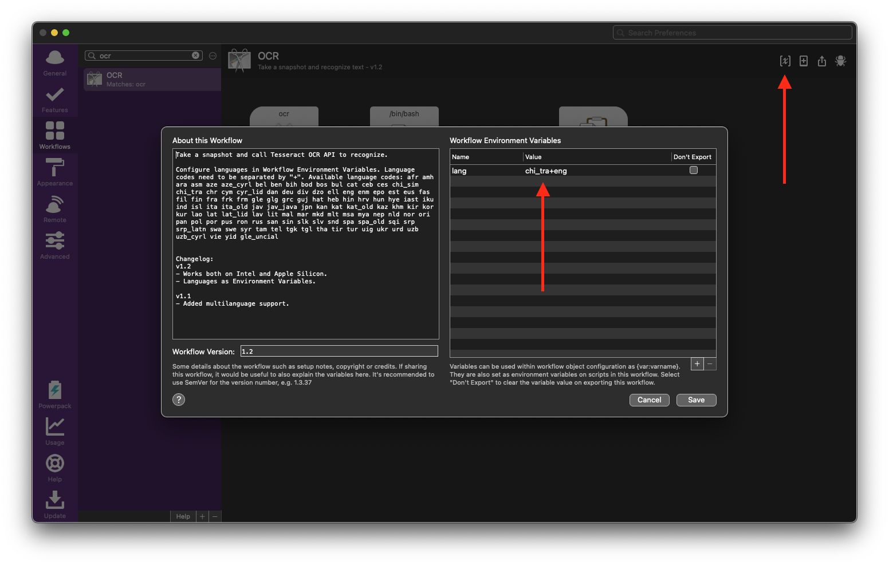

# Alfred Workflow OCR

[](https://postimg.cc/5jRSjcqQ)

## Basic usage
1. Type `ocr` in Alfred
2. Take a screenshot
3. Wait for the notification
4. Paste the text!

## Language configuration

You can use this workflow to recognise text in any languages available in Tesseract, also in multiple languages at once.

Check list of available language codes [here](https://github.com/tesseract-ocr/tesseract/blob/b67ea2c1a70c56053e142a5fb7cc18fb29cdc4b8/src/training/language-specific.sh#L21).

### Single use
You can select any language for each run by typing optional argument like this: `ocr fra`

### Default languages
You can use this workflow without any argument. Then the script uses languages configured in Environment Variables. Language codes need to be separated by `+` 



## Installation

1. Install `tesseract` on your system: 
  - Install [Homebrew](https://brew.sh) if you haven't
  - Then run `brew install tesseract` (if you need English only) or `brew install tesseract-lang` (if you need additional langugages, this will install most of the popular languages)
2. Download the workflow from Releases tab
3. Double click to install it in Alfred

## What's inside

```bash
export PATH="/usr/local/bin:$PATH:/opt/homebrew/bin:$PATH"
screencapture -i /tmp/ocr_snapshot.png

if [{query} = ""]; then 
  tesseract /tmp/ocr_snapshot.png stdout -l $lang 2>&1
else 
  tesseract /tmp/ocr_snapshot.png stdout -l {query} 2>&1 
fi
```

## Changelog
### v1.2
- Works both on Intel and Apple Silicon.
- Languages as Environment Variables.

### v1.1
- Added multilanguage support.

## Discussion
On Alfred forum: https://www.alfredforum.com/topic/12006-ocr-extract-text-from-snapshot/

## Credits
Based on [project](https://github.com/nicooprat/alfred-ocr) by nicooprat
Based on [project](https://github.com/johnnyhoichuen/alfred-ocr) by johnnyhoichuen
